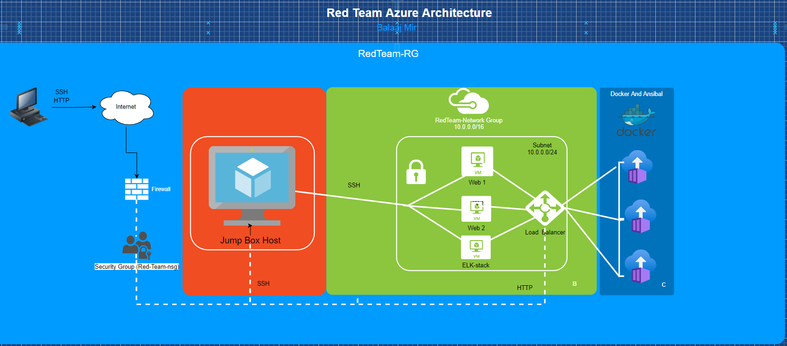

# ELK-Stack-Project
## Automated ELK Stack Deployment

The files in this repository were used to configure the network depicted below.

These files have been tested and used to generate a live ELK deployment on Azure. They can be used to either recreate the entire deployment pictured above. Alternatively, select portions of the YMLfile may be used to install only certain pieces of it, such as Filebeat.

  

This document contains the following details:
- Description of the Topologu
- Access Policies
- ELK Configuration
  - Beats in Use
  - Machines Being Monitored
- How to Use the Ansible Build

### Description of the Topology

The main purpose of this network is to expose a load-balanced and monitored instance of DVWA, the D*mn Vulnerable Web Application.

Load balancing ensures that the application will be highly available, in addition to restricting exposing the backend servers to the network.
The Aspect of security that load balancers protect are the availabilty in regrades the CIA triad, where it is supported through rudenency and network performance
A jumpbox is mainly used for System Administration and used as a secure externel network access
The Advantge to the Jump box is one it allows you to access your servers without a bastion host and also it is the center point for launching adminstration tasks. 
Any Managment tasks must be done Through the connected jumpbox and because of the configured for resticted access of the jumpbox which internally provides a more secure enviroment

Integrating an ELK server allows users to easily monitor the vulnerable VMs for changes to the filesystm and system resouces.
- Filebeat is a lightweight shipper for forwarding and centralizing log data.
 Installed as an agent on your servers, Filebeat monitors the log files or locations that you specify, collects log events, and forwards them either to Elasticsearch or Logstash for indexing

- Metricbeat takes the metrics and statistics that it collects and ships them to the output that you specify, such as Elasticsearch or Logstash.
 Metricbeat helps you monitor your servers by collecting metrics from the system and services running on the server

The configuration details of each machine may be found below.

| Name     | Function | IP Address    | Operating System |
|----------|----------|------------   |------------------|
| Jump Box | Gateway  |13.68.135.196  | Linux Ubuntu     |
| ELK VM   | ELK Stack|104.208.153.229| Linux Ubuntu     |
| Web 1    | DOCKER   | 10.0.0.5      | Linux Ubuntu     |
| Web 2    | DOCKER   | 10.0.0.6      | Linux Ubuntu     |

### Access Policies

The machines on the internal network are not exposed to the public Internet. 

Only the Jumpbox machine can accept connections from the Internet. Access to this machine is only allowed from the following IP addresses:
Admins Personal IP

Machines within the network can only be accessed by Jumpbox.
Which machine did you allow to access your ELK VM? What was its IP address?_ Jump-Box-Provisioner 10.0.0.7

A summary of the access policies in place can be found in the table below.

| Name     | Publicly Accessible | Allowed IP Addresses |
|----------|---------------------|----------------------|
| Jump Box | Yes                 | Admins Personal IP   |
| Elk-Stack| Yes                 | 10.0.0.7             |
| Web-1    | No	                 | 10.0.0.7             |
| Web-2    | No                  | 10.0.0.7             |

### Elk Configuration

Ansible was used to automate configuration of the ELK machine. No configuration was performed manually, which is advantageous because...
- _TODO: Anisble brings is automation of and simpliplification of repetative, complex, and tedious operations a systems admin.

The playbook implements the following tasks:

-Install: docker.io
-Install python-pip
-Install  docker module
-Increase Memory Use: sysctl -w vm.max_map_count=262144
-Download and Launch a docker elk container
- ...

The following screenshot displays the result of running `docker ps` after successfully configuring the ELK instance.

### Target Machines & Beats
This ELK server is configured to monitor the following machines:
- _TODO: List the IP addresses of the machines you are monitoring_

Web-1: 10.0.0.5

Web-2: 10.0.0.6

We have installed the following Beats on these machines:
- _TODO: 
Web-1: 10.0.0.5

Web-2: 10.0.0.6

These Beats allow us to collect the following information from each machine:
- _TODO: 
Web-1: 10.0.0.5

Web-2: 10.0.0.6

-Filebeat monitors log files or locations you specify, collects log events, and forwards them to Elasticsearch
-Metricbeat collects metrics from the operating system and from services running on the server. Metricbeat then takes the metrics and statistics that it collects and ships them to the output that you specify.

### Using the Playbook
In order to use the playbook, you will need to have an Ansible control node already configured. Assuming you have such a control node provisioned: 

SSH into the control node and follow the steps below:
- Copy the Install_filebeat_Playbook.yml file to /etc/ansible/roles/files/ directory.
- Update the config file to include the private ip of the Elk VM, to the  ElasticSearch and Kibana sections of the configuration file
- Run the playbook, and navigate tohttp://[104.208.153.229/]:5601/app/kibana to check that the installation worked as expected.

Answer the following questions to fill in the blanks:_
- _Which file is the playbook? Where do you copy it? copy it to the elk stack server
- _Which file do you update to make Ansible run the playbook on a specific machine? How do I specify which machine to install the ELK server on versus which to install Filebeat on?_ filebeat config and metric beat config
- _Which URL do you navigate to in order to check that the ELK server is running?
- http://20.110.100.166:5601/app/kibana

_As a **Bonus**, provide the specific commands the user will need to run to download the playbook, update the files, etc._

-ssh sysadmin@JumpBox(PrivateIP 13.68.135.196)
-sudo docker container list -a (locate your ansible container)
-sudo docker start container (name of the container)
-sudo docker attach container (name of the container)
-cd /etc/ansible/
-ansible-playbook Install_elk_playbook.yml (configures Elk-Server and starts the Elk container on the Elk-Server)
-cd /etc/ansible/roles/
-ansible-playbook Install_filebeat-playbook.yml (installs Filebeat and Metricbeat)
-ansible-playbook Install_metricbeat-playbook.yml
-open a new web browser session and navigate to (Elk-Server 104.208.153.229:5601) This will bring up the Kibana Web Portal
